Revision History
================

2020\. 9. 4 : Initial doc

[[Revision History]{.ul}](#revision-history)

[[Main Features]{.ul}](#main-features)

[[Install Requirements]{.ul}](#install-requirements)

[[Usage Manual]{.ul}](#usage-manual)

> [[Get Started]{.ul}](#get-started)
>
> [[Tool brief]{.ul}](#tool-brief)
>
> [[Spline tool mode on the
> activation]{.ul}](#spline-tool-mode-on-the-activation)
>
> [[Create New Spline]{.ul}](#create-new-spline)
>
> [[Add a new point on the existing
> spline]{.ul}](#add-a-new-point-on-the-existing-spline)
>
> [[Edit Spline points]{.ul}](#edit-spline-points)
>
> [[Control point in the scene]{.ul}](#control-point-in-the-scene)
>
> [[Control point component in the
> inspector]{.ul}](#control-point-component-in-the-inspector)
>
> [[Popup Menu for the control
> Point]{.ul}](#popup-menu-for-the-control-point)
>
> [[Edit a Spline Component]{.ul}](#edit-a-spline-component)
>
> [[Spline Component in the
> inspector]{.ul}](#spline-component-in-the-inspector)
>
> [[Edit Bending controllers]{.ul}](#edit-bending-controllers)
>
> [[Add Bending controllers on the
> spline]{.ul}](#add-bending-controllers-on-the-spline)
>
> [[Bending Controller component In the
> inspector]{.ul}](#bending-controller-component-in-the-inspector)
>
> [[Popup Menu for the bending
> controller]{.ul}](#popup-menu-for-the-bending-controller)
>
> [[Spline Component Group]{.ul}](#spline-component-group)
>
> [[Edit a Spline Component Group]{.ul}](#edit-a-spline-component-group)

[[Code Compatibility]{.ul}](#code-compatibility)

Main Features
=============

Make a spline on line renderer

Can generate a new wire mesh through the splines

Install Requirements
====================

Unity 2019.4 Above

HDRP

Usage Manual
============

Get Started
-----------

**Option 1**. Use Menu bar at "Template/Spline Tools/Run "Spline Tool"

{width="4.791666666666667in"
height="2.1666666666666665in"}

**Option 2**. Activate [[Custom editor
tool]{.ul}](https://docs.unity3d.com/Manual/UsingCustomEditorTools.html),
and then click "Simple Screen Capture Tool"

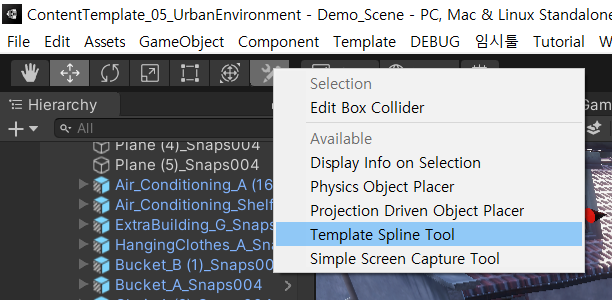{width="5.769375546806649in"
height="2.8281255468066493in"}

Tool brief
----------

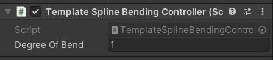{width="6.260324803149606in"
height="3.401042213473316in"}

Spline tool mode on the activation
----------------------------------

### Create New Spline

{width="6.151042213473316in"
height="3.026233595800525in"}

If a user does not select any GameObjects on the time of the tool
activation, the spline tool works for creating new spline components. By
clicking a left mouse button, you can make an initial control point with
a Spline component on the surface.

### Add a new point on the existing spline

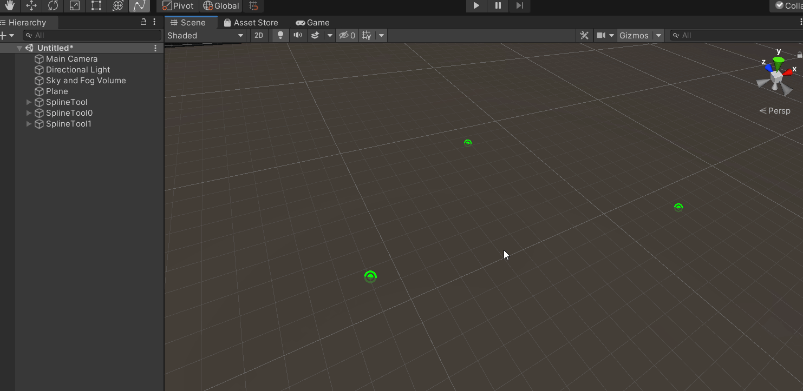{width="6.098958880139983in"
height="2.968429571303587in"}

If a user selects any GameObjects related to the existing Splines, the
tool works for adding a new control point. By ctrl + left mouse button,
a new control point can be created on the hitting surface.

Edit Spline points
------------------

### 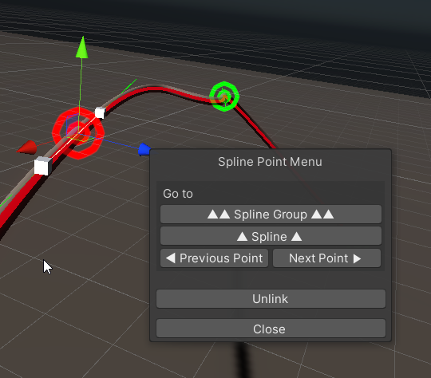{width="0.3177088801399825in" height="0.301823053368329in"} Control point in the scene

Users can directly control points by the Gizmo. Move, Rotate, Scale for
the point is possible.

{width="6.244792213473316in"
height="3.650485564304462in"}

### Control point component in the inspector

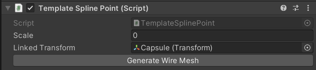{width="4.25in" height="1.5416666666666667in"}

**Scale** : Puts a strain on the control points of the spline curve. If
the Scale value is 0, the spline does not bend and has a straight line.

**Linked Transform** : The control point follows the designated
transform position.

**Generate Wire Mesh** : The wire mesh is regenerated with the spline of
the currently selected control point.

### Popup Menu for the control Point

By right-clicking the control point, you can bring up an additional
pop-up menu.

**Option 1**. When only one control point is selected

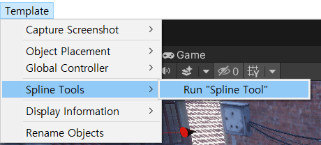{width="4.526042213473316in"
height="3.9728587051618547in"}

**Go to Spline Group** : Finds a Spline Group of the selected Control
Point.

**Go to Spline** : Finds a Spline of the selected Control Point.

**Go to Previous Point** : It finds the previous point connected to the
selected control point.

**Go to Next Point** : It finds the next point connected to the selected
control point.

**Unlink** : Initialize the Linked Transform value of the spline point
component and disconnect it.

**Option 2**. When multiple control points are selected

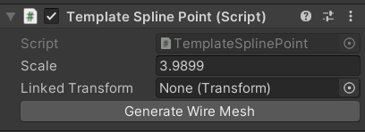{width="4.703125546806649in"
height="2.8942311898512685in"}

**Unlink** : Initialize the Linked Transform value of the spline point
component and disconnect it.

**Snap Points** : Snaps positions of Points or Transforms selected.

Edit a Spline Component
-----------------------

### Spline Component in the inspector

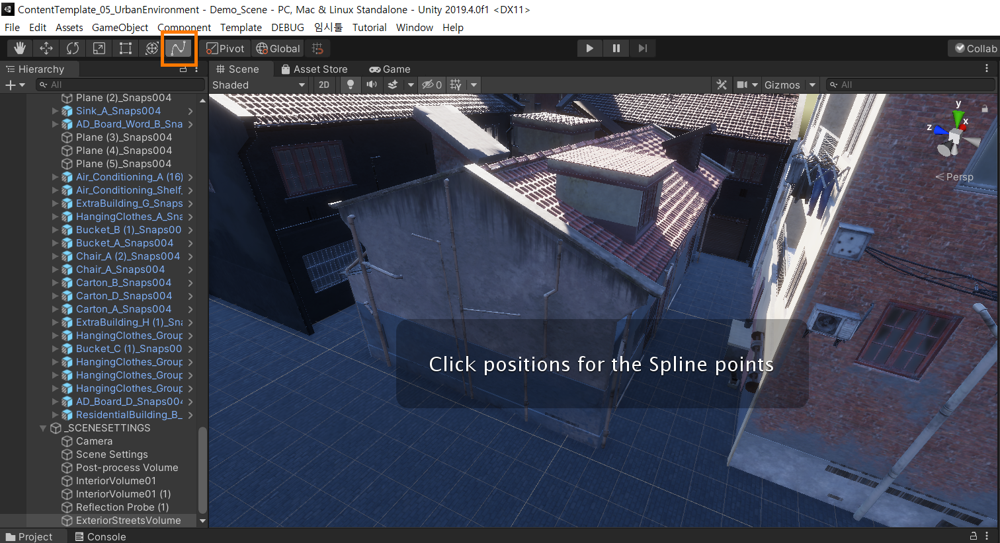{width="4.229166666666667in"
height="2.8229166666666665in"}

**Color** : Spline color for a preview on the spline

**Width** : Spline rendering width

**Number of Points** : point counts for drawing a line. A bigger value
can make a spline more smooth.

**Diameter** : a diameter of the generated mesh

**Radial Segments** : roundness for a circle generated. A bigger value
can make a wire get a more round shape.

**Enable Bending** : Add controllers for bending wires after meshes are
generated.

**Enable Spline Render** : to turn a rendering on/off

**Generate Wire Mesh** : Create a wire mesh based on the selected spline

Edit Bending controllers
------------------------

### Add Bending controllers on the spline

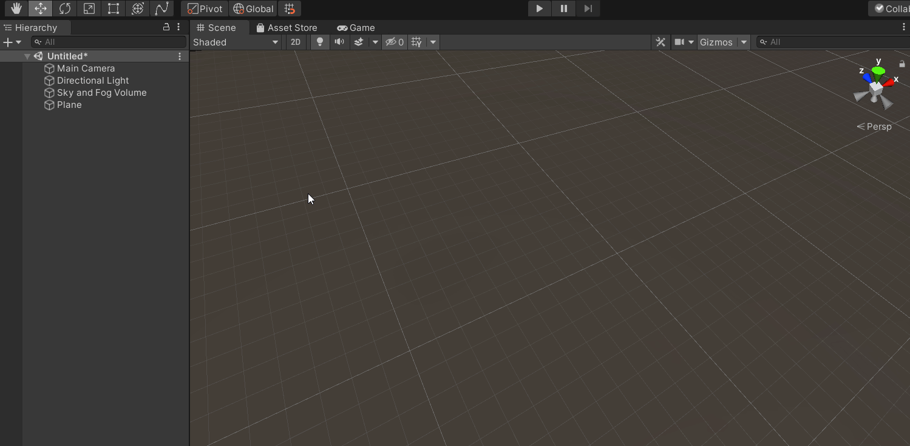{width="6.265625546806649in"
height="2.6809645669291338in"}

Need to set "Enable Bending" enabled, and then press "Generate Wire
Mesh"

### Bending Controller component In the inspector

{width="4.666666666666667in"
height="1.0416666666666667in"}

**Degree of Bend** : Can control the range of bendness

{width="6.098958880139983in"
height="2.3457534995625546in"}

### Popup Menu for the bending controller

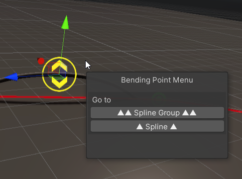{width="4.401042213473316in"
height="3.2600306211723535in"}

**Go to Spline Group** : Finds a Spline Group of the selected Bending
Point.

**Go to Spline** : Finds a Spline of the selected Bending Point.

Spline Component Group
----------------------

### Edit a Spline Component Group

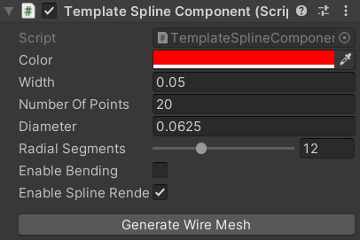{width="4.645833333333333in"
height="1.4166666666666667in"}

**Linked Clone** : Duplicate all splines in the Group and connect cloned
ones to the original splines. It's good when you want to make a power
pole with multiple splines. For a good result, there are some
preconditions about the setting of the Group.

{width="6.317708880139983in"
height="3.7764501312335956in"}

1.  The starting point of each spline should be connected to the prefab
    > or model or any objects which have a transform. "Linked Transform"
    > should be filled up.

> {width="5.526042213473316in"
> height="1.230961286089239in"}

2.  Prefab or model should be placed under this component as well

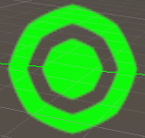{width="5.472178477690289in"
height="2.182292213473316in"}

Generate Meshes : Generate All Meshes along the splines in the Group

Code Compatibility
==================

Unity 2019.4.0f1 + HDRP(7.3.1) Tested.
